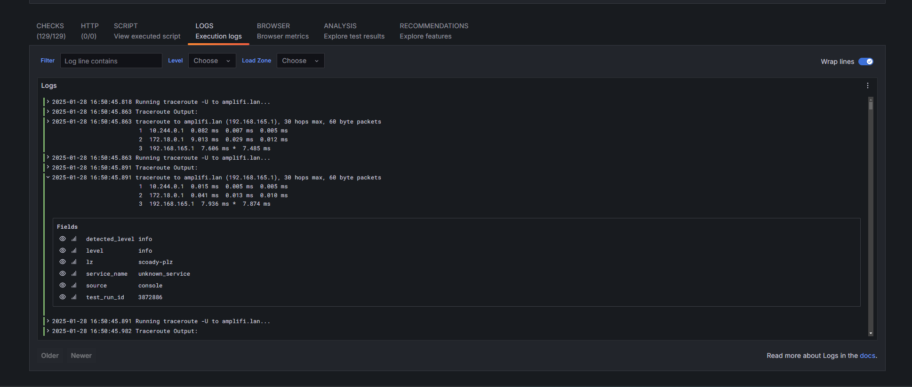
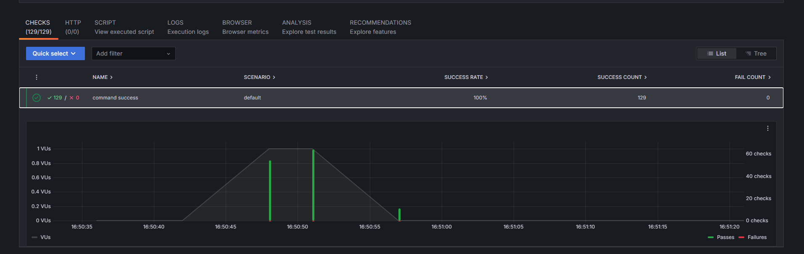

WIP

#### Why build this?

* The vanilla k6 binary offers a lot of support out of the box, but there could be a number of cases where you need additional resources. In my specific example, I needed to be able to run something with the ability to issue a `traceroute` command. 

* The [xk6](https://github.com/grafana/xk6) ecosystem allows for just that, it allows for you to bring additional functionality to the existing k6 binary. You can do this by writing extensions. There are a number of already existing extensions, so we're going to build one of those in to a custom container image and use it for the runner for our k6 tests.

[This](https://github.com/grafana/xk6-exec) library gives the k6 environment access to operating system level built-ins, which is exactly what I needed!

See an example of the test run here: https://seancoady.grafana.net/a/k6-app/runs/3872886?tab=checks 

The following is necessary to run a custom k6 binary:

* Build custom binary and container image
* A kubernetes cluster with k6-operator installed
* A Private Load Zone
* A TestRun resource to execute your test, using the custom container image with the extension built in. 


#### Build the custom container image (and binary)

* Requires go 1.22+
* Recommended to use `goenv` to manage your go versions

* Bump the version in ./VERSION
* ./build

* This build uses the `xk6` extension system to build on extensions on top of the base k6 binary. That can be seen in the Dockerfile, with this bit:
```yaml
RUN GCO_ENABLED=0 xk6 build \
    --with github.com/grafana/xk6-exec  \
    --output /k6
```

You can add any extension you want this way, and will have access to a ton of different functionality as a result.

This specific extension allows for access to system level calls, in my example, `traceroute`. 


#### Adding a test

** Need to genericize this a bit, sse scripts/run.js for an example of a test.


After submitting your test, you should start to see results in the K6 UI!



#### Deployment Requirements

* Functional kubernetes cluster
* k6 operator installed (you can use the values file I have in `k8s/k6-operator/values.yaml` and it should work out of the box)
* Deploy to a private load zone, see `k8s/plzs/` for examples
* Add your secrets for the PLZs by following these [instructions](https://grafana.com/docs/grafana-cloud/testing/k6/author-run/private-load-zone-v2/#create-the-plz-crd)
* Create an instance of a test by creating a `TestRun` instance, examples in `k8s/testruns/TestRun.yaml`  